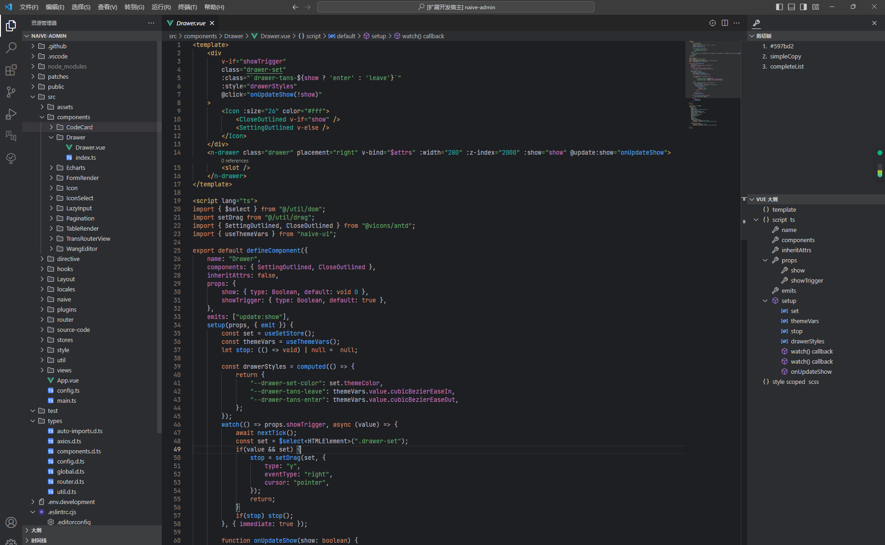

  <h1 align="center">vsocde-tools</h1>

Tools for VS Code.

### Function list:

1. Clipboard
2. Current file location
3. Vue outline
4. Preview SVG
5. JetBrains Icon Theme 2023+
6. JetBrains Theme 2023+

### Example

